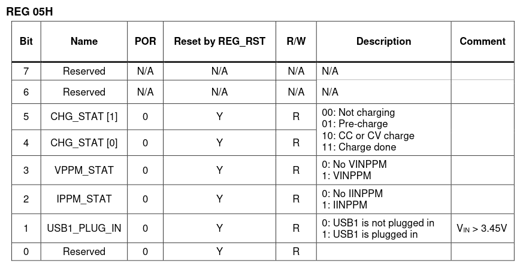
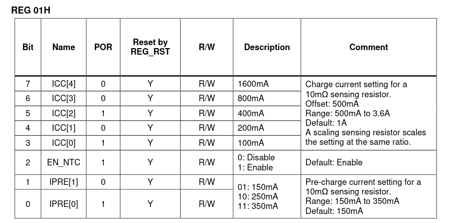

# SmallRegister

This library simplifies bitfield handling and adds some safety features, mostly relying on compile-time checks.
`SmallRegister` maps bitfields of registers in Big Endian order and allows easy read-out and setting/clearing 
operations.

C++17 is required to use it. The library is header-only.

It's intended to be used with tiny sensor ICs from which the data is obtained through I2C, SPI, UART, ... It could
be used to handle protocol header formatting as well.

As an example consider that you have to implement handling of a temperature, humidity sensor, or an external ADC, or 
an external GPIO expander, etc... You wire it to your ESP32, STM32, AVR, ... using I2C, SPI, UART, ...
You want to have easy access to the bitfields obtained over the wire. This is when `SmallRegister` comes in and can
solve your problem.

## Tutorial

Let's take [MP2695](https://www.monolithicpower.com/en/mp2695.html) IC on the table. It is a:

> I2C-Controlled, Single-Cell Switching Charger with JEITA Profile

From the datasheet we can see that it has a register addressed with `0x05H` value, called "Status register"
and its layout looks like that:



Let's map it using `SmallRegister`:

```
#include "small_register/small_register.hpp"

enum class status
{
    reserved1 = 0,
    chg_stat,
    vppm_stat,
    ippm_stat,
    usb1_plug_in,
    reserved2
};

using namespace jungles;
using Status = small_register<uint8_t, // Defines the underlying type of the register. Can be uint8_t, uint16_t, ...
                              bitfield<status::reserved1, 2>, // First the ID of the register, and then its bit-size
                              bitfield<status::chg_stat, 2>,
                              bitfield<status::vppm_stat, 1>,
                              bitfield<status::ippm_stat, 1>,
                              bitfield<status::usb1_plug_in, 1>,
                              bitfield<status::reserved2, 1>>;
```

Then when you want to check if the USB1 is plugged in simply:

```
bool MP2695::is_usb_plugged_in()
{
    // Read the register over the wire
    uint8_t status_register_address{0x05};
    auto reg{mp2695_on_i2c_interface.read(status_register_address)}; // Depends on your implementation.

    // Initialize our Status register with the obtained data. It will map to proper bitfields.
    Status status_reg{reg}; 
    
    return status_reg.get<status::usb1_plug_in>() == 1;
}
```

Note that the `get()` function is a template function. It prevents from confusing the names, e.g.:

```
// MP2695 "Fault register" field IDs
enum class fault
{
    batt_uvlo = 0,
    reserved1,
    chg_fault,
    ntc_fault
};

...
Status status_reg{};
status_reg.get<fault::chg_fault>(); // ERROR: "Bitfield ID not found"
``` 

The same goes for any other member function.

When you want to set some configuration from scratch; for `REG 0x01H`, in the MP2695 IC:



```
enum class charge_control1
{
    icc = 0,
    en_ntc,
    ipre,
};

using ChargeControl1 = small_register<uint8_t,
                                      bitfield<charge_control1::icc, 5>,
                                      bitfield<charge_control1::en_ntc, 1>,
                                      bitfield<charge_control1::ipre, 2>>;
```

And then let's configure charging:

```
void MP2695::configure_charging()
{
    ChargeControl1 charge_control1_reg{}; // Will initialize with zeros

    // Set charge current to 2.5A
    charge_control1_reg.set<charge_control1::icc>(0b10100); // Sets corresponding bits when explicitly specified.
    
    // Disable charging (this doesn't take effect since the bit is already cleared but good for documentation)
    charge_control1_reg.clear<charge_control1::en_ntc>(); // Clears all the bits
    // Equivalent:
    charge_control1_reg.clear<charge_control1::en_ntc>(0b1);

    // Set pre-charge current to max
    charge_control1_reg.set<charge_control1::ipre>(0b11);
    // Equivalent:
    charge_control1_reg.set<charge_control1::ipre>();

    uint8_t raw_register_value{charge_control1_reg()}; // Access the raw value (of uint8_t type) with operator()

    // Write the register over the wire
    uint8_t charge_control1_register_address{0x02};
    mp2695_on_i2c_interface.write(charge_control1_register_address, raw_register_value); 
}
```

Note that for the `set` operation you can set the bitfield value explicitly or implicitly. It works like `|=` operator.
So for example:

```
ChargeControl1 charge_control1_reg{}; // Raw register value: 0b00000000
charge_control1_reg.set<charge_control1::icc>(0b10100); // Raw register value: 0b10100000
charge_control1_reg.set<charge_control1::icc>(0b00001); // Raw register value: 0b10101000
```

which is equivalent to:

```
uint8_t r{0};
r |= (0b10100) << 3;
r |= (0b00001) << 3;
```

`SmallRegister` makes the shifting for you, so you don't need to remember to do the shifting. 

when not specyfying the value to be set:

```
ChargeControl1 charge_control1_reg{}; // Raw register value: 0b00000000
charge_control1_reg.set<charge_control1::icc>(); // Raw register value: 0b11111000
```

The whole bitfield is set.

`clear` operation works analogously, but it follows the `&= ~( value )` idiom, e.g.:

```
ChargeControl1 charge_control1_reg{0b10101000};
charge_control1_reg.clear<charge_control1::icc>(0b10100); // Raw register value: 0b00001000
```

The library works pretty well when updating a register. Consider that you want to change only the charge current
in the `REG 0x01H` and leave the other bitfields unchanged.

```
void MP2695::change_charge_current_to_3_amps()
{
    uint8_t charge_control1_register_address{0x02};
    auto raw_value{mp2695_on_i2c_interface.read(charge_control1_register_address)}; 
    ChargeControl1 reg{raw_value};

    // Set and clear operations can be chained as well:
    reg.clear<charge_control1::icc>().set<charge_control1::icc>(0b11001); // EN_NTC and IPRE stay the same

    mp2695_on_i2c_interface.write(charge_control1_register_address, reg()); 
}
```

Be careful when using `set` and `clear` functions with explicit bitfield values, because when the value doesn't match, 
e.g. when the bitfield is of size 5 bits and you want to set 6 bits, an exception is thrown:

```
ChargeControl1 charge_control1_reg{};
charge_control1_reg.set<charge_control1::icc>(0b100000); // throws overflow_error{}
```

### Using small_map

`SmallRegister` allows to map register addresses to corresponding register types, e.g.:

```
using MP2695MemoryMap = jungles::small_map<element<0x00, ChargeControl0>,
                                           element<0x01, ChargeControl1>,
                                           element<0x02, ChargeControl2>,
                                           element<0x05, Status>,
                                           element<0x06, Fault>,
                                           element<0x07, Miscellaneous>,
                                           element<0x08, Jeita>>;
```

Then the corresponding type can be accessed with:
```
using ChargeControl1 = typename MP2695MemoryMap::register_from_address<0x01>::type;

```

Provided that `ChargeControl0`, `ChargeControl1`, ... are type aliases for `jungles::small_register`.

## Downloading and incorporating the library to a project

The preferred way is to use `CMake`:

```
cmake_minimum_required(VERSION 3.16)

include(FetchContent)
FetchContent_Declare(SmallRegister
    GIT_REPOSITORY https://github.com/KKoovalsky/SmallRegister.git
    GIT_TAG main # Use the latest tag to be safe
)
FetchContent_MakeAvailable(SmallRegister)
target_link_libraries(your_app PUBLIC SmallRegister)
```

You can use the library as a submodule as well or simply download the headers from `small_register` directory.

## API

[API documentation](docs/api.md)

## Running tests

```
mkdir build
cd build
cmake -DSMALL_REGISTERS_ENABLE_TESTING:BOOL=ON ..
make
ctest
```
